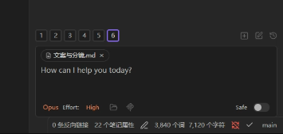
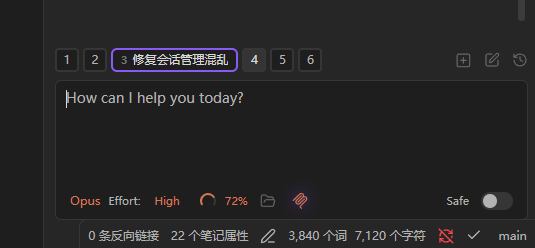

# Claudian Tab Title Patch

> 让 Obsidian 内置 AI 助手 Claudian 的当前标签显示对话标题，告别纯数字编号。

| Before | After |
|--------|-------|
|  |  |

## 问题

Claudian 多开对话时，底部标签栏只显示数字编号（1、2、3……），完全分不清哪个是哪个，经常点错导致指令发到错误的会话。

## 效果

| 修改前 | 修改后 |
|--------|--------|
| 所有标签只显示数字 | 当前标签展开显示对话标题 |
| 多个对话完全分不清 | 一眼就知道哪个是哪个 |
| 经常点错发错消息 | 切换标签时标题实时跟着变 |

- 只有当前活跃标签展开显示标题，其他标签保持数字，不占空间
- 切换标签时标题跟着变，有展开动画
- 不影响 Claudian 任何原有功能

## 使用方法

### 前提条件

- 已安装 [Node.js](https://nodejs.org)（LTS 版本即可）
- Obsidian 已安装 Claudian 插件

### 方法一：双击安装（推荐）

1. [下载最新版本](../../releases/latest)，解压得到一个文件夹
2. 把整个文件夹放到你的 **Obsidian 库根目录**
3. 双击运行：
   - **Windows**：`一键安装.bat`
   - **Mac**：`一键安装.command`
4. 重启 Obsidian，搞定

> **Mac 用户注意**：首次双击 `.command` 文件如果提示权限不足，打开终端运行：
> ```bash
> chmod +x 一键安装.command 一键还原.command
> ```

### 方法二：命令行

```bash
node patch-claudian-tabs.js "/path/to/your/vault"
```

## 还原

不想要了？随时还原到插件原始状态：

- **双击**：`一键还原.bat`（Windows） / `一键还原.command`（Mac）
- **命令行**：`node patch-claudian-tabs.js --undo "/path/to/your/vault"`

## 常见问题

**Claudian 插件更新后补丁还在吗？**

不在。Claudian 更新会覆盖 `main.js`，重新运行一次脚本即可。

**会影响 Claudian 的正常功能吗？**

不会。只修改标签显示逻辑，核心功能完全不变。运行前自动备份原文件（`.bak`），支持一键还原。

**脚本提示"插件版本不兼容"？**

Claudian 更新后代码结构可能变化。脚本会自动还原备份，插件不受影响。请到 [Issues](../../issues) 反馈，我会尽快适配新版本。

**可以重复运行吗？**

可以。脚本会自动检测是否已打过补丁，重复运行不会出问题。

## 工作原理

修改 `.obsidian/plugins/claudian/` 下的两个文件：

- **main.js**：将活跃标签的 `renderBadge()` 从纯数字改为「编号 + 标题」双 span 结构
- **styles.css**：添加 `.claudian-tab-badge-expanded` 展开样式（自适应宽度、文字溢出省略、胶囊动画）

运行前自动备份为 `.bak` 文件，`--undo` 从备份还原。

## 文件说明

```
claudian-tab-title-patch/
├── patch-claudian-tabs.js   ← 核心补丁脚本
├── 一键安装.bat             ← Windows 双击安装
├── 一键安装.command         ← Mac 双击安装
├── 一键还原.bat             ← Windows 双击还原
├── 一键还原.command         ← Mac 双击还原
└── screenshots/             ← 效果截图
```

## License

[MIT](LICENSE)

---

by [云间AI手册](https://space.bilibili.com/670641466) · 工具快分享 VOL.004
